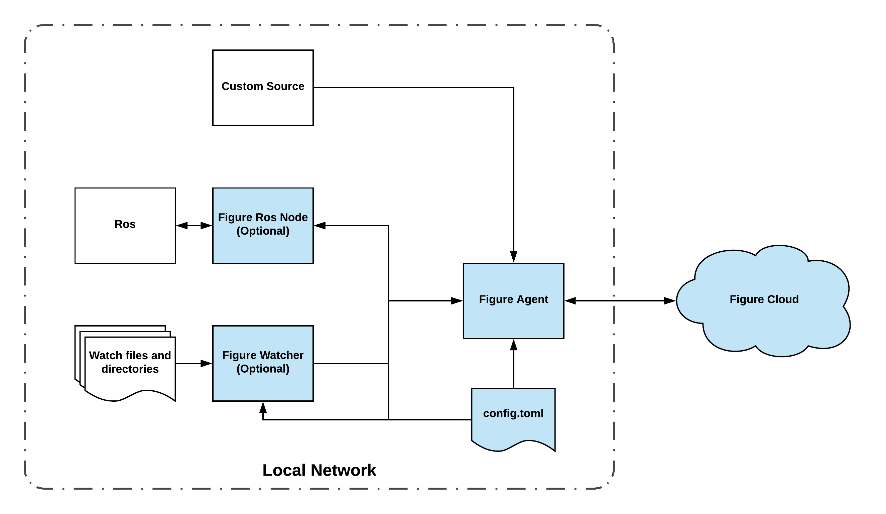
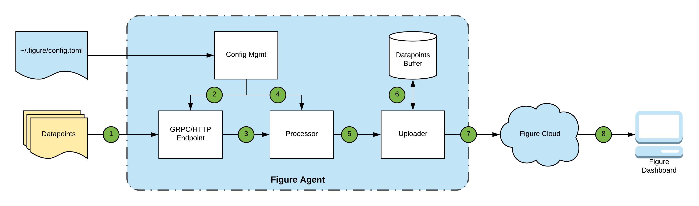

# Figure

This repository provides software releases and documentation for development with Figure.

Table of Contents
=================

   * [Figure](#figure)
   * [Table of Contents](#table-of-contents)
      * [Agent](#agent)
        * [Figure Agent](#figure-agent)
        * [Figure Watcher](#figure-watcher)
        * [Figure ROS Node](#figure-ros-node)
        * [Datapoint Lifecycle](*datapoint-lifecycle)
         * [Quick Start](#quick-start)
         * [Install &amp; Setup](#install--setup)
            * [ROS Setup](#ros-setup)
         * [Configuration](#configuration)
            * [Figure](#figure-1)
            * [Tags](#tags)
            * [Streams](#streams)
            * [Basic Stream](#basic-stream)
            * [Tagging Streams](#tagging-streams)
            * [Directory Stream](#directory-stream)
            * [File Tail Stream](#file-tail-stream)
         * [ROS Stream](#ros-stream)
         * [Developing](#developing)
            * [GRPC](#grpc)
            * [HTTP](#http)


## Agent

The Figure Agent provides a simple managed ingestion entrypoint to the Figure Cloud.



The architecture of the Figure Agent allows for a single Figure Agent installation to be reachable by different local-network-connected nodes which can stream data to the central Figure Agent. The `config.toml` controls the setup of each of these components and should be readable by each (or copied).

### Figure Agent

The Figure Agent is the ingestion funnel to the Figure Cloud. It handles secure communication, data buffering, and in-flight compression. It exposes both a GRPC and HTTP endpoint for streaming and posting data.


### Figure Watcher

The Figure Watcher manages watching directories and tailing files. It manages the connection and streaming datapoints to the Figure Agent.


### Figure ROS Node

The Figure ROS Node is a low overhead forwarder of ROS topics. It provides an easy way to integrate your existing ROS stack with the Figure Agent. It will automatically subscribe to topics and stream ROS msgs from those topics to the Figure Agent. The Figure Agent and Figure ROS Node communicate the message types and message descriptions necessary for the Figure Agent to parse the different message types. This allows you to avoid the overhead of (de)serialization between ROS and Figure.

### Datapoint Lifecycle

The Figure Agent ingests tagged streams of datapoints. Below is a diagram describing the lifecycle of datapoints in the Figure Ecosystem.




1. A Source streams or posts a datapoint to the Figure Agent.
2. The Figure Agent does an initial validation on the datapoint to ensure it belongs to a stream defined in the config, has a valid timestamp (milliseconds since the epoch), and does not have empty data.
3. Upon succesful validation, the datapoint is queued for processing. For ROS datapoints we unpack the message and extract the relevant data.
4. During the processing step we apply the tags defined in the configuration. 
5. After processing the datapoint is queued for upload in the Uploader.
6. The Uploader uses a small database to buffer datapoints while it is uploading. This also allows us to retry failed datapoint uploads.
7. The Uploader then batches and uploads datapoints to the Figure Cloud.
8. As a user, the datapoints total travel time to the Figure Dashboard will be under 5 seconds (network limitations permitting.)

### Quick Start

1. Download the latest release.
2. Create the `$HOME/.figure/config.toml` configuration file (can be empty)
3. Extract the `figure-agent` binary from the tar package and run it.
4. Sign in with your admin credentials when asked.
5. Run one of the [examples](examples).

### Install & Setup

The Figure Agent Components are available for Linux amd 64 bit OS architectures. They are currently available as binaries in the Releases section of this repository. In the future Debian packages, containers, and binaries for additional operating systems and architectures will be available.

The Figure Agent requires read/write access to the directory `$HOME/.figure/` where `$HOME` is the home directory of the user used to run the Figure Agent components.

The Figure Cloud uses asymmetric authentication to verify the identity of each agent. To generate credentials for your agent run the Figure Agent. On first launch, it will prompt you to enter your admin `username` and `password`, which authenticates with the Figure Cloud and generates a unique asymmetric key for your agent. Internally, the Figure Agent periodically generates an expiring signed JWT(JSON Web Token) that the Figure Cloud uses to verify the agents identity. These credentials will be stored in `$HOME/.figure/`.

When running the components, ensure the server is up and running first. The ros-node and the watcher will both attempt reconnections if the server is not up or goes down, however it will be cleaner to start the server first.

If you ever delete the contents of `$HOME/.figure/`, you will need to re-run the agent installation step.

#### ROS Setup

The Figure Agent can integrate directly with ROS Topics. There are several options for adding our Figure ROS Node to your ROS system.

The first, and preferred, option is to add the `figure-ros-node.par` binary to a launch file. The `par` binary contains all the necessary dependencies and manages the Figure Agent communication channel.

The second option is to manage the `figure-ros-node.par` binary as a binary executable, and run it after your ROS master and nodes are up. This will be a simpler path for initial development and debugging but includes the overhead of managing the lifecycle outside of a launch file.

The third option is to develop your own ROS node against the Figure Agent GRPC or HTTP endpoints. This is a more complex path, as the Figure ROS Node manages picking up all the ROS specific streams from the agent and registering their data types and msg descriptions with the server.

You can find an example of a launch file in the [ros examples](examples/ros/) directory.

### Configuration

The Figure Configuration is specified in a `toml` configuration file. This file must be located at `$HOME/.figure/config.toml` where `$HOME` is the home directory of the user used to run the Figure Agent components.

Please note that both the Figure Agent and Figure Watcher require access to the `config.toml` file.

Here is a sample [config.toml](config.toml).

There are several important parts to this configuration.

#### Figure

```toml
[figure]
agent-server-port-grpc = "5501" #optional
agent-server-port-http = "5502" #optional
agent-server-ip = "10.10.1.10" #optional
```


The `[figure]` section enumerates all the Figure specific components to customize the agent GRPC and HTTP endpoints.

`agent-server-ip`: The IP on the local network that the Figure Agent will be reachable at. (Default: `localhost`)

`agent-server-port-grpc`: The port on which the Figure Agent should expose its GRPC endpoint. (Default: `5501`)

`agent-server-port-http`: The port on which the Figure Agent should expose its HTTP endpoint. (Default: `5502`)

#### Tags

```toml
[tags]
site = "san_francisco_1"
environment = "dev"
group = "engineering"
```

The `[tags]` section enumerates the agent-wide tags used for all streaming data points. These tags will be added to every stream for this agent.

#### Streams

Streams are defined by a `toml` array. Each Stream is prefixed with a `[[streams]]` identifier. You are limited to 20 streams per agent. Streams are processed first to last in the `config.toml`. Streams that have invalid configuration or over the limit will not be accepted.

The agent will throttle high-frequency data streams to 5Hz.

#### Basic Stream

```toml
[[streams]]
name = "robot.arm.state"
```
This is the bare minimum required to identify a stream.

#### Tagging Streams

```toml
[[streams]]
name = "robot.arm.state"
[tags]
arm="arm.12345"
```

You can also individually add tags to a stream.

#### Directory Stream

```toml
[[streams]]
name = "camera.image.drop"
dir = "/home/camera/upload"
figure-type = "image"
ext = ".jpg"
```

This is an example of a directory watching stream. We need to define several components so that the watcher knows how to parse and transmit the files to the Figure Agent.

`dir`: the directory to watch. The Figure Watcher must have read access to this directory.

`figure-type`: the figure data type for this directory watch stream.
We currently support the following data types for directory watching:

1. `image`
2. `video`
3. `point cloud`

`ext` : The extention to watch for. Please note the included `.` in the extension.

#### File Tail Stream
```toml
[[streams]]
name = "test.log"
filename = "/home/abraham/test.log"
file-format = "json" #optional
time-key = "timestamp" #optional
time-format = "2006-01-02T15:04:05Z07:00" #optional
```

The file tail stream allows you to ingest a text file as datapoints (one datapoint per line).

`filename`: The absolute path to the file to tail. The Figure Watcher must have read access to this file.

`file-format`: (Optional) The format of the file. Currently we only support 
`json`.

`time-key`: (Optional) The `key` used for timestamps in `json`.

`time-format`: (Optional) The format of the timestamp. The format defines  how the reference time, defined to be:

`Mon Jan 2 15:04:05 -0700 MST 2006`

would be interpreted if it were the value; it serves as an example of the input format.

Here are some examples for common RFC implementations:
```toml
ANSIC       = "Mon Jan _2 15:04:05 2006"
UnixDate    = "Mon Jan _2 15:04:05 MST 2006"
RubyDate    = "Mon Jan 02 15:04:05 -0700 2006"
RFC822      = "02 Jan 06 15:04 MST"
RFC822Z     = "02 Jan 06 15:04 -0700" # RFC822 with numeric zone
RFC850      = "Monday, 02-Jan-06 15:04:05 MST"
RFC1123     = "Mon, 02 Jan 2006 15:04:05 MST"
RFC1123Z    = "Mon, 02 Jan 2006 15:04:05 -0700" # RFC1123 with numeric zone
RFC3339     = "2006-01-02T15:04:05Z07:00"
RFC3339Nano = "2006-01-02T15:04:05.999999999Z07:00"
```

If the the timestamp is not provided the Figure Watcher will generate a timestamp when it detects a newline in the file.

### ROS Stream

```toml
[[streams]]
name = "abb.joint_2.position"
ros-topic = "/joint_states/joint_2"
ros-path = "data" #optional
```

By deploying the Figure ROS Node, you can listen to specific ros topics without writing code.

We support the following data types (parsed from ros messages):

1. text
2. numeric (all standard float and int message types)
3. image (from both `sensor_msgs/CompressedImage` and `sensor_msgs/Image` message types)
4. point clouds (from `sensor_msgs/PointCloud2` message type)

The optional `ros-data` parameter allows you to specify (using dot notation) the path to the data point you want to extract. If the ros data cannot be interpreted as one of the supported ros data types, we will attempt to translate it to `JSON` and log it as a text line. Even if your message only has one value but is under a `data` key you will need to specify that in the config.

### Images as Video Stream

One of the features of the Figure Cloud is the ability to visualize images as video streams. To enable this feature all you need to do is modify the `figure-type` flag for that stream. For example,

```toml
[[streams]]
name = "camera.image.drop"
dir = "/home/camera/upload"
figure-type = "video"
ext = ".jpg"
```

Now the Figure Agent knows to annotate this stream as a `video` stream so it is visualized properly in the Figure Dashboard.

Similarly, you can do this with ROS streams:

```toml
[[streams]]
name = "robot.cam.001"
figure-type = "video"
ros-topic = "/image_topic"
```

### Developing

If you are using just the Figure ROS Node and the Figure Watcher to create data points then there is nothing left for you to do! However, if you want to develop against the agent-sever and stream your own data points then please continue.

There are several optoins to develop against the Figure Agent. The prefered method is by using the GRPC endpoint.

#### GRPC

If you are unfamiliar with GRPC you can read about it [here](https://grpc.io/).

Once you are setup to develop against GRPC, you can take the [agent.proto](agent.proto) and generate your language specific code stubs.

There are two ways to send data to the agent (NOTE: your stream must be defined as at least a basic stream.)

Both `PostData` and `StreamData` accept the same `Data` message type:

```protobuf
message Data {
    // Stream name. Must match stream in config.
    string stream = 1;
    // Timestamp in miliseconds from epoch.
    int64 timestamp = 2;
    // Content Type defined by enum above.
    ContentType type = 3;
    // Raw byte data.
    bytes data = 4;
}
```

The first, and preferred, implementation is to use the `StreamData` rpc which accepts a stream of `Data` messages.

The second way is to use the `PostData` rpc. This a unary type rpc that allows you to make calls in a non-streaming context.

Examples of these implementations in several languages are available in the [examples](examples/) folder.

#### HTTP
The Figure Agent also exposes a `http` endpoint.

You can `POST` data to the `/v1/data` endpoint with the following `JSON` syntax:

```json
{
    "stream": "<stream name>",
    "timestamp": 1538624058748,
    "type": "<CONTENT_TYPE>",
    "data" : "<base64 encoded bytes>"
}
```

`ContentType` is defined as:
```protobuf
// Data point Content Types.
enum ContentType {
    UNKONWN = 0;
    TEXT = 1;
    NUMERIC = 2;
    PNG = 3;
    JPEG = 4;
    VIDEO = 5;
    FILE = 6;
    POINTCLOUD = 7;
    ROS = 11;
    // Unsupported
    ROSBAG = 8;
    JSON = 9;
    YAML = 10;
}
```
So, for example, to send a datapoint with the text `this is a datapoint` to stream `stream.001` you would post to `/v1/data`:

```json
{
    "stream": "stream.001",
    "timestamp": 1538624058748,
    "type": "TEXT",
    "data" : "dGhpcyBpcyBhIGRhdGFwb2ludA=="
}
```

Examples of these implementations in several languages are available in the [examples](examples/) folder.